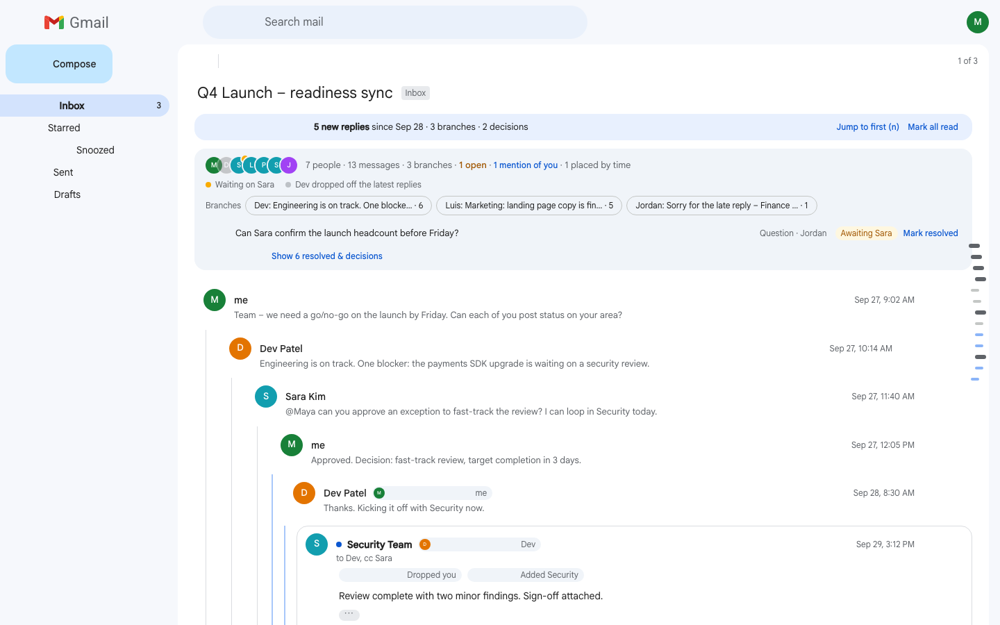
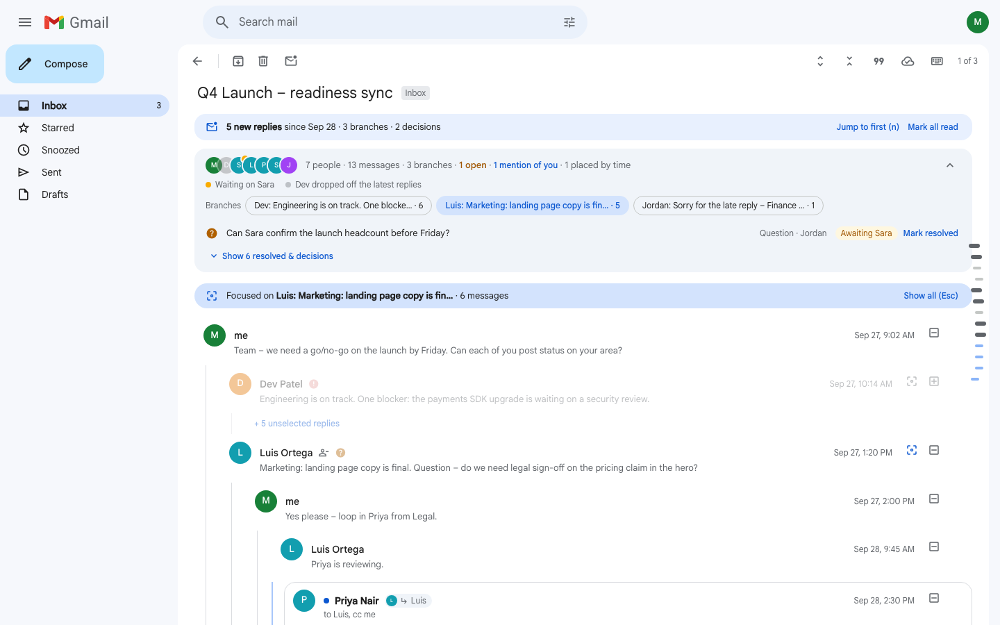
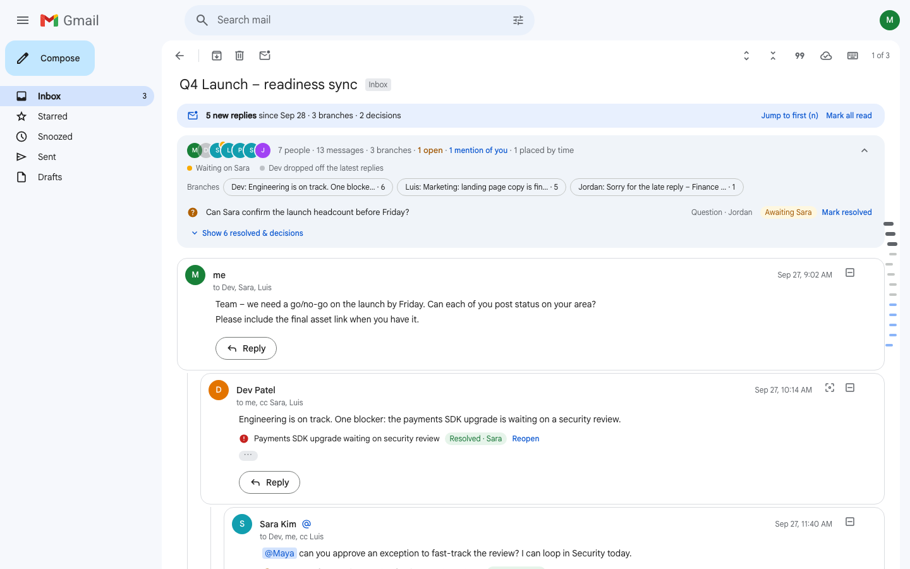

# Gmail Threading Redesign

A working prototype that shows what was decided, what is still open, and who dropped off in long Gmail threads.

| | |
|---|---|
| **Live demo** | https://gmail-threading-redesign-mu.vercel.app |
| **Walkthrough video** | `TODO(Yugant): Loom link` |
| **Design rationale** | [docs/DESIGN.md](docs/DESIGN.md) |

This is a design exercise prototype and is not affiliated with Google.



## The problem

Gmail shows a conversation as a flat list. In threads with 10 or more people, that causes three problems.

- **Status amnesia.** A blocker raised in reply 2 is settled in reply 7. Nothing links them, so reply 11 asks again.
- **Audience drift.** Someone replies to a subset. People fall off To and Cc, and the person a question was aimed at never sees it.
- **Branching disorientation.** Several topics run at once and are mixed together in one list.

## What I built

**Focus branch.** Press `b` or click a branch chip to keep one conversation sharp from the first message to the latest reply. Other branches dim and collapse into a "+N unselected replies" chip. `Esc` brings everything back.



**Resolution ledger.** The overview lists decisions, questions and blockers. A question counts as resolved when someone it was aimed at replies below it. A blocker is resolved by the latest decision below it. Each chip names who closed it and jumps to that reply. You can always mark an item resolved or reopen it yourself. Open items come first and the rest are one click away.

**Audience drift.** Every reply is compared with its parent's recipients. A badge shows who was dropped or added, in amber when a dropped person still owes an answer. The composer warns you when someone who owes an answer elsewhere in the thread is not on your reply.



It also works as a small mailbox. It has folders, search, stars, archive and trash with undo, a compose window with draft autosave, and replies that survive a reload.

| Key | Action | Key | Action |
|---|---|---|---|
| `j` / `k` | Next or previous message | `b` | Focus this branch, `Esc` to leave |
| `o` | Open or close a message | `f` | Fold or unfold replies |
| `r` | Reply inline | `x` | Resolve or reopen the message's item |
| `n` | Next unread, across branches | `Ctrl` or `⌘` + `Enter` | Send |

## Key decisions

| Decision | Chosen | Over | Why |
|---|---|---|---|
| Layout | Vertical tree, indent capped at 3 levels, 2 on phones | Graphs and side-by-side columns | They break on a 375px screen and lose reading order. |
| Resolution | Status derived from the thread and always overridable | Automatic summaries | A confident wrong summary is worse than none, and you can't audit it. |
| Dropped off | Absent from the latest reply of every branch | Absent from the newest message | The simple rule flags almost everyone in a forked thread. |
| Offline | Send is blocked, with an explicit Queue for later | Queueing silently | Silently queueing text you think was sent is the worse failure. |

The full reasoning, the research and the iteration history are in [docs/DESIGN.md](docs/DESIGN.md).

## Edge cases and tests

- Reply loops, missing parents, duplicate ids and bad timestamps always produce one valid tree.
- Quoted history from Gmail and Outlook is split out. Inline replies stay intact.
- Storage that is missing, full or corrupt never crashes the app.
- Nothing scrolls sideways at 375px, even with every feature on.
- Logic tests use Node's built-in runner. Browser tests drive headless Chrome through the DevTools Protocol. There are no dependencies.
- `npm test` runs 110 logic tests and 133 browser tests at 1440px and 375px.

## Run it locally

You need Node.js 22 or newer and Google Chrome or Chromium. There is nothing to install.

```bash
# Optional: serve on http://localhost:5173. index.html also opens straight from disk.
npm start
```

The page loads React, Tailwind and fonts from public CDNs, so it needs a network connection.

```bash
# Run logic unit tests
node --test "tests/*.test.js"

# Run headless browser suite via Chrome DevTools Protocol
node tests/run-ui.js
```

`npm test` runs both. Set `UI_ONLY="focus"` to run matching browser tests, `UI_VIEWPORT=mobile` to limit the width, or `CHROME=/path/to/chrome` to pick a browser.

## Project structure

```
.
├── index.html               App shell and React components, compiled in the browser by Babel
├── src/
│   ├── threading.js         Pure logic: tree building, ledger, unread, audience drift, lineage
│   ├── mailbox.js           Pure logic: folders, search, inbox rows, new conversations
│   ├── hooks.js             React hooks: routing, focus, shortcuts, draft autosave, scroll tracking
│   ├── storage.js           Guarded localStorage helpers for drafts, read markers and replies
│   ├── sample-data.js       Demo conversations, with dates relative to today
│   └── styles.css           Design tokens, buttons and motion
├── tests/
│   ├── threading.test.js    Logic tests for src/threading.js
│   ├── mailbox.test.js      Logic tests for src/mailbox.js
│   ├── ui-tests.js          Browser suite, loaded by index.html when opened with ?e2e
│   ├── run-ui.js            Runs that suite in headless Chrome at desktop and phone widths
│   ├── screenshots.js       Captures docs/screenshots at both widths
│   └── support/browser.js   Small Chrome DevTools Protocol driver
├── scripts/serve.js         Static server for `npm start`
├── docs/
│   ├── DESIGN.md            Users, priorities, research, trade-offs, iteration history
│   ├── LOOM_SCRIPT.md       Talking points for the walkthrough video
│   └── screenshots/         Images used in this README
└── package.json             Scripts only, no dependencies
```
